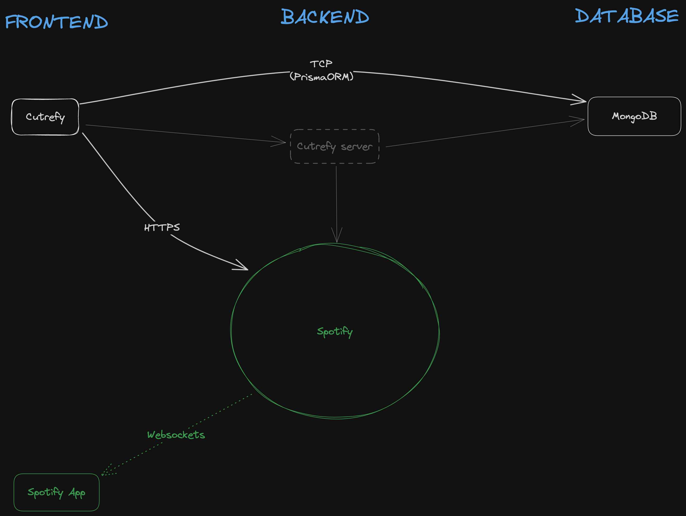

# Cutrefy



Cutrefy is a small PoC app that uses the Spotify API to:
* login
* read a playlist
* play a track

Please, this project is NOT ready for any kind of production environment. The quality of the code is far from good!

## Tech stack

* Remix.run
* Tailwind CSS
* Prisma ORM
* MongoDB (Mongo Atlas)

## Env vars

| name                | required | description                                                                           |
|---------------------|----------|---------------------------------------------------------------------------------------|
| SPOTIFY_CLIENT_ID   | true     | Client ID obtained when registering the app in the Spotify for Developers website     |
| SPOTIFY_SECRET_ID   | true     | Client Secret obtained when registering the app in the Spotify for Developers website |
| SPOTIFY_PLAYLIST_ID | true     | Id of the playlist you want to display                                                |
| SESSION_SECRET      | false    | Secret for cookies                                                                    |
| DATABASE_URL        | true     | PrismaORM connection string to a Mongo Cluster. Mongo Atlas is recommended            |


## Endpoints
* `/` main app
* `/login` handles the login against the Spotify API
# How to?
### Develop

From your terminal:

```sh
npm run dev
```

This starts your app in development mode, rebuilding assets on file changes.

### Deploy

First, build your app for production:

```sh
npm run build
```

Then run the app in production mode:

```sh
npm start
```

Now you'll need to pick a host to deploy it to.

#### DIY

If you're familiar with deploying node applications, the built-in Remix app server is production-ready.

Make sure to deploy the output of `remix build`

- `build/`
- `public/build/`
